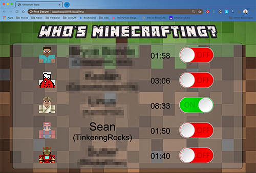
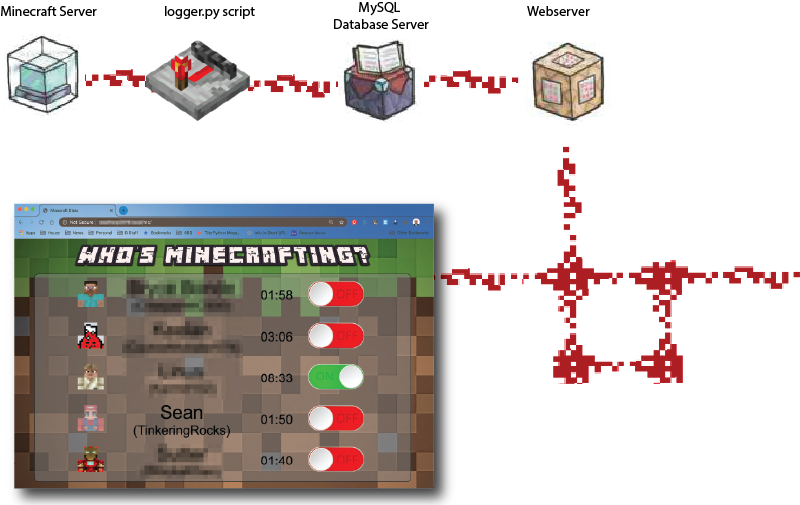

# mcDashboard - A Simple Minecraft Time Tracking Dashboard for Family & Friends Servers

## Overview



Minecraft has made a huge resurgence this year among my friends and family. The renewed interest is due in no small part to our shelter-in-place practice during the COVID-19 Pandemic as we search for new ways to gather and to communicate with one another. I recently worked with my kids to set up a multiplayer server at home. Within a day we were all hooked. Within two days, none of us knew what day it was. I got worried that we may have a time management crisis ahead. We started spending so much time in Minecraft that I wanted to make sure we kept track of it.

My goal with this project is not to impose time limits (at least not yet). Instead, I wanted to use this dashboard as a reference, a tool, a teachable moment for my kids. Each morning the time clocks reset themselves. During the day, each player accumulates more time on the board. At the end of their play, they can compare how much time they perceived to have passed with how much time has actually passed. The goal of this dashboard is to help teach my kids how to regulate their online time by giving them a clock that doesn't lie.

Please keep in mind that this project is a proof of concept and a learning opportunity for me. It's not meant to be a turn-key solution. If you follow this guide, you should be able to implement it on your own Minecraft server. You are welcome to use any or all of this code to create your own awesome dashboard.

## Getting started



There are several moving parts to this dashboard application. There's the logger script that polls the Minecraft server every minute. The Logger persists the logged in user information to a MySQL server. A Webserver then pulls the latest tally out of MySQL and displays it on a webpage. If you are using it as an information screen like me, you will also have a computer running this webpage in kiosk-mode. The good news is that you can probably fit all of these components onto one [Raspberry Pi](https://www.raspberrypi.org) System on a Chip (SoC) computer. That's what we're using at our house, but with one exception. I have a MySQL Server running already for another project, so I'm hosting this application there as well.


## What You Will Need

1. A good text editor. You will be modifying the configuration settings within Python scripts of this application. If you do not have a favorite already, may I recommend [Atom](https://atom.io)?
1. A Raspberry Pi Computer or a spare PC that can run your favorite flavor of Linux. Yes, you can probably make all of this work on a Windows machine, but for this how-to, we're going to stick to Linux. Your Linux host will need:
    1. Shell access. You will be installing some applications and configuring cron jobs. In Raspberry Pi, this is easy as you can open a terminal window when a keyboard and monitor are attached, or you can SSH into the Pi and configure everything through terminal. If your Linux host belongs to someone else, like your hosting provider, you may need to get some help. Shell access is not absolutely required if you can still install all the requisite software through other means. But shell access is certainly the easier path.
    1. [Python3](https://python.org) should be installed along with these libraries:
        - [mysql-connector](https://dev.mysql.com/doc/connector-python/en)
        - [mcstatus](https://github.com/Dinnerbone/mcstatus)
    1. A web server installed and configured to serve the web application files in the mcDashboard directory. [Apache](https://httpd.apache.org/) or [Nginx](https://www.nginx.com/) will do just fine. See the WebServer section below for important configuration tasks. The webserver will need to be configured to run python3 as a script interpreter.
    1. MySQL latest stable build. You will need the appropriate permissions to create a database, add tables, and run CREATE, INSERT, UPDATE, DELETE, and SELECT.
    1. phpMyAdmin (optional) - This is a graphical administration tool for MySQL.  It makes the database administration tasks much simpler.
1. Access to a Minecraft Server with the query service enabled and accessible to your Raspberry Pi device (make sure the [ports through any firewalls are opened correctly](https://portforward.com/minecraft/))


## Configuration

### Command-line access

If this is your first time logging into a Raspeberry Pi and using the command line. Welcome to the slippery slope that is Linux administration. You now have powers that you never dreamed possible. Your only limit is your imagination... and possibly some permissions imposed by your systems administrator :)

Working in Linux you'll find most installs need to be performed by a user with elevated privileges. If you are using your own Raspberry Pi, no problem, just issue the sudo command when prompted. If you are unable to run installs via sudo, this may be the stopping point for you on this host. To test if you can sudo, run the following command:

`sudo -v`

If you see something like this, then you're good-to-go:

```
pi@Dashboard2:~ $ sudo -v

We trust you have received the usual lecture from the local System
Administrator. It usually boils down to these three things:

    #1) Respect the privacy of others.
    #2) Think before you type.
    #3) With great power comes great responsibility.

[sudo] password for pi:
pi@Dashboard2:~ $
```

### Logger.py script

First, using your text editor, you will need to configure the following items within the script:
- Minecraft server IP address or hostname
- MySQL credentials
-- Host address
-- Username
-- Password
-- DatabaseName

### MySQL Server

Once MySQL server is installed and running on your host, you will need to create a database for this application. The default is mcDashboard, but you can choose whichever name you prefer.  In the [SQL](SQL/) folder, you'll find sample SQL queries for:
- Creating the two data tables for this applications
- Creating the SQL view that the dashboard application will query for aggregate data.
- Creating the application username and password and to grant that user the appropriate permissions for this database.

**Please note:** the database name, the username, and the password you configured in MySQL. You will need to add those values to both the logger and the dashboard application scripts (logger.py & mcstatus.cgi)

### Web Server

This is always the part of the installation that takes the longest amount of time. The short explanation is **security**.  Our modern web servers work on the front line of a war against scripted malicious attackers who try to exploit known weaknesses in server code so that the perpetrator can attempt to access your system. The web server applications are hardened to give at least a basic level of security for your system. For that reason, a lot of the bells and whistles are turned off by default in order to reduce the surface area that an attacker can try to manipulate. In order for this application to work, your will need to ensure your web server has the following configured:

- The web server allows script handling for the directory where you installed the mcDashboard code and assets.

- The file extension .cgi must be recognized as a script and that Python3 is one of the script handlers entitle for that extension.

- If your web server is Internet facing, consider placing this application behind a password protected section of your site.  The names of your family members, their gamer handle, and whether they're online at this time is sensitive information and should not be made public.

I've kept the baseline web server section kind of vague, because every Linux system is a little different and different web server applications implement these in a number of ways. This is the point where I'm going to envourage you to Google it :)

The last thing you'll need to do is to enter your MySQL and Minecraft server details into the **mcstats.cgi** file in your web application directory:

- Minecraft server IP address or hostname
- MySQL credentials
-- Host address
-- Username
-- Password
-- DatabaseName

To test if your web server is configured correctly, point your web browser at the `http://<servername>/<installed_location>/mcstatus.cgi`. If you see something that looks like this. You should be all set:

```
 {"stats":[{"player_name":"TinkeringRocks",...}]
```

If you see some plain text that starts with

```
#!/usr/bin/python3
import mysql.connector
from mcstatus import MinecraftServer
```

you still have some configuration to do in order to get the webserver to interpret the script as an executable.

Your moment of truth will be to launch the web application. If you see Sad Steve like below, then you should have everything on the web server side configured. The system just needs to start logging data.


### Setting the CRON Job for the Logger application

Calling a script via CRON is not the sexiest way to implement a program. But it's a proven method and it's easy to troubleshoot when it breaks. For those reasons it's still my favorite way to loop a task. Quite simply, we need to set CRON to call the logger application every minute. To create a new CRON entry, use the following command from your shell prompt:

`crontab -e`

In the text editor, you may see other programs that are already scheduled. We'll add the following to the bottom of the list:

`* * * * * /<path to your logger script directory/logger.py`

There's lots of [crontab](https://support.acquia.com/hc/en-us/articles/360004224494-Cron-time-string-format) documentation about what each of those asterisks mean. Simply, it refers to which timeslots for the
- minute of each hour
- hour of each day
- day of each month
- month of each year
- day of the week
Since we answere * from "all" this script will run every minute of every hour, of every day, Monday through Sunday.

Once you've added the cron entry above and saved it, go back to your application, and try logging into your Minecraft server. Within a minute you should see your username pop up on the screen.
